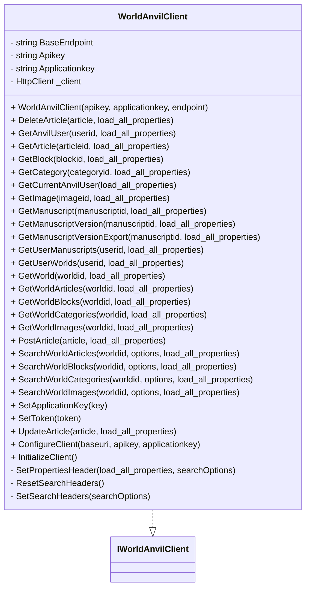

# WorldAnvilClient.cs

This file implements the `WorldAnvilClient`, a C# client library for interacting with the World Anvil API. It provides a range of methods for retrieving, searching, creating, updating, and deleting World Anvil resources such as articles, worlds, users, images, manuscripts, and more.

---

## Key Features

- **API Interaction:** Communicates with World Anvil's REST API using `HttpClient`.
- **Model Mapping:** Serializes and deserializes JSON data to strongly-typed .NET objects (e.g., `Article`, `World`).
- **Authentication:** Handles API and application keys for secure access.
- **Flexible Configuration:** Supports changing endpoints, tokens, and keys dynamically.
- **Advanced Search:** Allows property control and search options via headers.

---

## Core Structure

Below is an overview of the major components and relationships:



---

## Initialization

### Creating a Client Instance

You instantiate the client with your API key and application key. Optionally, you can provide a different endpoint.

```csharp
var client = new WorldAnvilClient("your_api_key", "your_app_key");
```

---

## Authentication & Configuration

- **API Key (**`**x-auth-token**`**):** Used for user authentication.
- **Application Key (**`**x-application-key**`**):** Application-level credential.
- **Dynamic Reconfiguration:** You can change keys and endpoints at runtime using:
- `SetApplicationKey(key)`
- `SetToken(token)`
- `OverrideEndpoint(url)`
- `ConfigureClient(baseuri, apikey, applicationkey)`

---

## Request/Response Flow

### Example: Get an Article

```csharp
Article article = client.GetArticle("articleId");
```

- Sets relevant headers.
- Sends a GET request to `article/{articleId}`.
- Deserializes the JSON response into an `Article` object.

---

## API Methods Overview

| Method | HTTP Verb | Endpoint Pattern | Description |
| --- | --- | --- | --- |
| `GetAnvilUser` | GET | user/{userid} | Get user details |
| `GetArticle` | GET | article/{articleid} | Get article details |
| `DeleteArticle` | DELETE | article/{articleid} | Delete an article |
| `PostArticle` | POST | article | Create a new article |
| `UpdateArticle` | PATCH | article/{articleid} | Update an existing article |
| `GetBlock` | GET | block/{blockid} | Get a block |
| `GetCategory` | GET | category/{categoryid} | Get a category |
| `GetCurrentAnvilUser` | GET | user | Get the current user |
| `GetImage` | GET | image/{imageid} | Get an image |
| `GetManuscript` | GET | manuscript/{manuscriptid} | Get a manuscript |
| `GetManuscriptVersion` | GET | manuscript/version/{id} | Get manuscript version |
| `GetManuscriptVersionExport` | GET | manuscript/{id}/export | Export a manuscript version |
| `GetUserManuscripts` | GET | user/{userid}/manuscripts | Get user's manuscripts |
| `GetUserWorlds` | GET | user/{userid}/worlds | Get user's worlds |
| `GetWorld` | GET | world/{worldid} | Get world details |
| `GetWorldArticles` | GET | world/{worldid}/articles | List world articles |
| `GetWorldBlocks` | GET | world/{worldid}/blocks | List world blocks |
| `GetWorldCategories` | GET | world/{worldid}/categories | List world categories |
| `GetWorldImages` | GET | world/{worldid}/images | List world images |
| `SearchWorldArticles` | GET | world/{worldid}/images | Search world articles |
| `SearchWorldBlocks` | GET | world/{worldid}/blocks | Search world blocks |
| `SearchWorldCategories` | GET | world/{worldid}/categories | Search world categories |
| `SearchWorldImages` | GET | world/{worldid}/images | Search world images |


---

## HTTP Headers

- **Authentication:** `x-auth-token`, `x-application-key`
- **Property Control:** `load_all_properties` (true/false)
- **Search Options:** When searching, additional headers are set:
- `term`, `offset`, `order_by`, `trajectory`

---

## Search & Filtering

Search-related methods allow you to control result filtering and sorting via the `AnvilSearchOptions` object. Headers are set accordingly for the request.

---

## Example API Documentation

### Get Article (GET /article/{articleid})

#### Get details for a specific article by its ID

```api
{
    "title": "Get Article",
    "description": "Retrieve an article by its unique ID.",
    "method": "GET",
    "baseUrl": "https://www.worldanvil.com/api/aragorn/",
    "endpoint": "article/{articleid}",
    "headers": [
        {
            "key": "x-auth-token",
            "value": "API key",
            "required": true
        },
        {
            "key": "x-application-key",
            "value": "Application key",
            "required": true
        },
        {
            "key": "load_all_properties",
            "value": "true|false",
            "required": false
        }
    ],
    "queryParams": [],
    "pathParams": [
        {
            "key": "articleid",
            "value": "The ID of the article",
            "required": true
        }
    ],
    "bodyType": "none",
    "requestBody": "",
    "formData": [],
    "rawBody": "",
    "responses": {
        "200": {
            "description": "The requested article",
            "body": "{\n  \"id\": \"abc123\",\n  \"title\": \"My Article\",\n  \"content\": \"...\"\n}"
        },
        "404": {
            "description": "Article not found",
            "body": "{\n  \"error\": \"Not Found\"\n}"
        }
    }
}
```

---

### Delete Article (DELETE /article/{articleid})

```api
{
    "title": "Delete Article",
    "description": "Deletes an article by its unique ID.",
    "method": "DELETE",
    "baseUrl": "https://www.worldanvil.com/api/aragorn/",
    "endpoint": "article/{articleid}",
    "headers": [
        {
            "key": "x-auth-token",
            "value": "API key",
            "required": true
        },
        {
            "key": "x-application-key",
            "value": "Application key",
            "required": true
        },
        {
            "key": "load_all_properties",
            "value": "true|false",
            "required": false
        }
    ],
    "queryParams": [],
    "pathParams": [
        {
            "key": "articleid",
            "value": "The ID of the article",
            "required": true
        }
    ],
    "bodyType": "none",
    "requestBody": "",
    "formData": [],
    "rawBody": "",
    "responses": {
        "200": {
            "description": "Article deleted successfully",
            "body": "{\n  \"success\": true\n}"
        },
        "404": {
            "description": "Article not found",
            "body": "{\n  \"error\": \"Not Found\"\n}"
        }
    }
}
```

---

### Post Article (POST /article)

```api
{
    "title": "Create Article",
    "description": "Creates a new article.",
    "method": "POST",
    "baseUrl": "https://www.worldanvil.com/api/aragorn/",
    "endpoint": "article",
    "headers": [
        {
            "key": "x-auth-token",
            "value": "API key",
            "required": true
        },
        {
            "key": "x-application-key",
            "value": "Application key",
            "required": true
        },
        {
            "key": "load_all_properties",
            "value": "true|false",
            "required": false
        }
    ],
    "queryParams": [],
    "pathParams": [],
    "bodyType": "json",
    "requestBody": "{\n  \"title\": \"My Article\",\n  \"content\": \"...\"\n}",
    "formData": [],
    "rawBody": "",
    "responses": {
        "201": {
            "description": "Article created successfully",
            "body": "{\n  \"id\": \"newId\",\n  \"title\": \"My Article\"\n}"
        },
        "400": {
            "description": "Invalid input",
            "body": "{\n  \"error\": \"Bad Request\"\n}"
        }
    }
}
```

---

### Patch Article (PATCH /article/{articleid})

```api
{
    "title": "Update Article",
    "description": "Updates an existing article.",
    "method": "PATCH",
    "baseUrl": "https://www.worldanvil.com/api/aragorn/",
    "endpoint": "article/{articleid}",
    "headers": [
        {
            "key": "x-auth-token",
            "value": "API key",
            "required": true
        },
        {
            "key": "x-application-key",
            "value": "Application key",
            "required": true
        },
        {
            "key": "load_all_properties",
            "value": "true|false",
            "required": false
        }
    ],
    "queryParams": [],
    "pathParams": [
        {
            "key": "articleid",
            "value": "The ID of the article",
            "required": true
        }
    ],
    "bodyType": "json",
    "requestBody": "{\n  \"title\": \"Updated Title\",\n  \"content\": \"...\"\n}",
    "formData": [],
    "rawBody": "",
    "responses": {
        "200": {
            "description": "Article updated successfully",
            "body": "{\n  \"id\": \"abc123\",\n  \"title\": \"Updated Title\"\n}"
        },
        "404": {
            "description": "Article not found",
            "body": "{\n  \"error\": \"Not Found\"\n}"
        }
    }
}
```

---

## Internal Mechanisms

### Client Initialization

Sets the HTTP client and adds default headers:

```csharp
_client = new HttpClient { BaseAddress = new Uri(BaseEndpoint) };
_client.DefaultRequestHeaders.Add("x-auth-token", Apikey);
_client.DefaultRequestHeaders.Add("x-application-key", Applicationkey);
_client.DefaultRequestHeaders.Add("load_all_properties", "false");
```

### Property and Search Headers

- **SetPropertiesHeader:** Updates `load_all_properties` and search headers.
- **ResetSearchHeaders:** Removes search-related headers.
- **SetSearchHeaders:** Adds `term`, `offset`, `order_by`, and `trajectory` for search.

---

## Usage Patterns

- **Get by ID:** Use `GetX(string id)` or `GetX(AnvilItem item)`
- **Delete:** Use `DeleteArticle(string id)`
- **Create:** Use `PostArticle(Article article)`
- **Update:** Use `UpdateArticle(Article article)`
- **List/Search:** Use `SearchWorldX` to filter and paginate results

---

## Error Handling

API methods return default values or throw exceptions on error.

- **No explicit error handling** in the provided code. You should wrap calls in try/catch when using this client.

---

## Best Practices

```card
{
    "title": "Best Practices",
    "content": "Always handle API exceptions and check for nulls before accessing properties. Use the search and property loading options to optimize data transfer."
}
```

---

## Limitations

- Uses synchronous calls (`.Result`), which may block threads in UI applications.
- No detailed error handling or logging.
- Not all API endpoints or features may be covered.

---

## Conclusion

The `WorldAnvilClient` class is a comprehensive client for World Anvil’s REST API, providing high-level, type-safe access to user, world, article, and manuscript data. It is easily configurable, supports advanced searches, and leverages .NET serialization for ease of use in modern .NET applications.

---